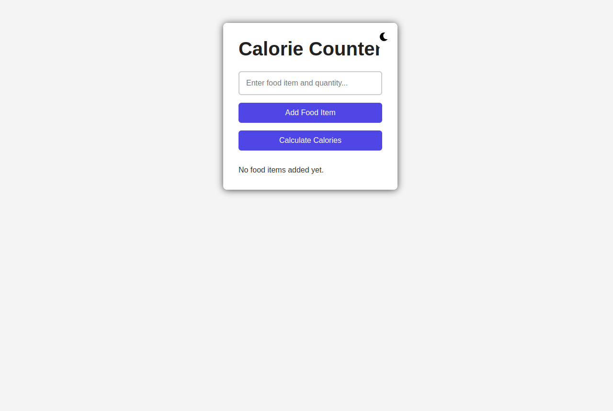

# CalorieCounter.ai 🥗

Type what you ate in plain English — *"2 boiled eggs, 100g chicken breast, a banana"* — and get an
instant **calorie + macro breakdown** (protein / carbs / fats), powered by AI.

**Live demo:** https://caloriecounter-ai-rohit-bagades-projects.vercel.app
**Stack:** React (Vite) · Express · OpenAI · TanStack Query · deployed on Vercel + Fly.io



---

## Features
- **Natural-language input** — no rigid forms; describe your meal however you want.
- **AI macro extraction** — standardizes each food, estimates calories + protein/carbs/fats per quantity.
- **Totals at a glance** — per-item and summed macros in a clean table.
- **Light / dark mode.**

## Architecture
```
frontend (React + Vite)  ──POST /chat──►  backend (Express)  ──►  OpenAI (JSON mode)
```
The API key lives only on the backend. The frontend never sees it.

## Run locally

**1. Backend**
```bash
cd backend
cp .env.example .env      # add your OPENAI_API_KEY
npm install
npm start                 # http://localhost:8080
```

**2. Frontend**
```bash
cd frontend
cp .env.example .env      # VITE_REACT_APP_API_URL=http://localhost:8080/chat
npm install
npm run dev               # http://localhost:5173
```

## Environment
| Where | Var | Purpose |
|---|---|---|
| backend | `OPENAI_API_KEY` | OpenAI key (required) |
| backend | `OPENAI_MODEL` | default `gpt-4o-mini` |
| backend | `PORT` | default `8080` |
| backend | `CORS_ORIGIN` | allowed frontend origin(s), comma-separated |
| frontend | `VITE_REACT_APP_API_URL` | full URL of the backend `/chat` endpoint |

## Production notes
- Backend restricts **CORS** to the configured origin, **rate-limits** `/chat` (20 req / 15 min / IP) so a
  public deploy can't drain your OpenAI budget, validates input, and uses OpenAI **JSON mode** for reliable parsing.
- Deploy: frontend → Vercel/Netlify, backend → Render/Fly. Set `CORS_ORIGIN` to the frontend URL and
  `VITE_REACT_APP_API_URL` to the backend `/chat` URL.

## License
MIT
